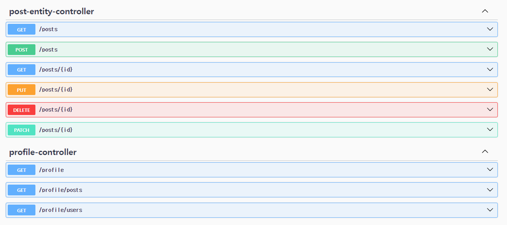
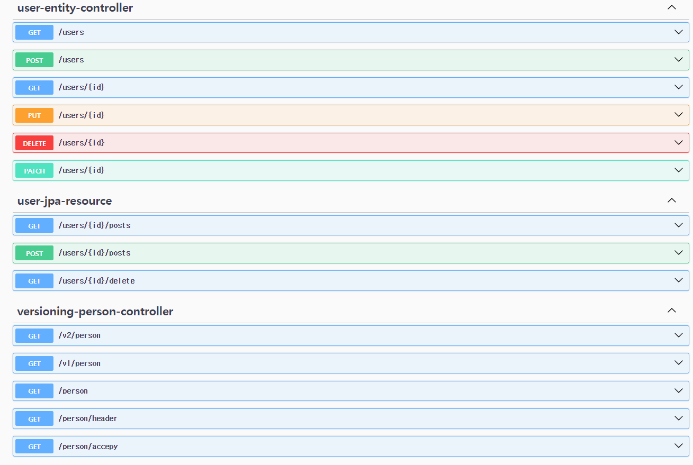
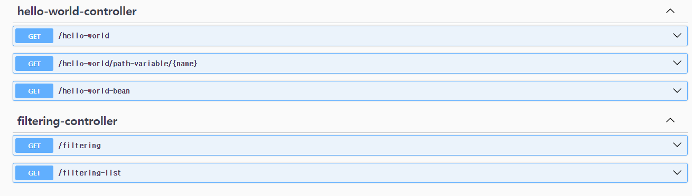

# Rest-api-service

## 개요

사용자는 유저와 게시물을 생성, 조회, 수정, 삭제(CRUD)할 수 있습니다. **Spring Boot**, **JPA**, **H2 데이터베이스**를 사용하여 백엔드를 구축했습니다.

## 기술 스택

- **Spring Boot**: 백엔드 프레임워크
- **JPA**: 데이터베이스 ORM (Object Relational Mapping)
- **H2 Database**: 인메모리 데이터베이스
- **REST API**: HTTP를 통한 리소스 관리
- **Swagger/OpenAPI**: API 문서화

### API 테스트 (Swagger UI)

`http://localhost:8080/swagger-ui.html`에서 Swagger UI를 통해 API를 테스트할 수 있습니다.

## 데이터베이스

- 기본적으로 **H2 Database**를 사용하며, 인메모리 데이터베이스라서 애플리케이션이 종료되면 데이터가 사라집니다.
- H2 데이터베이스 콘솔에 접속하려면 `http://localhost:8080/h2-console`에서 확인할 수 있습니다.

## 라이선스

이 프로젝트는 MIT 라이선스 하에 배포됩니다.
